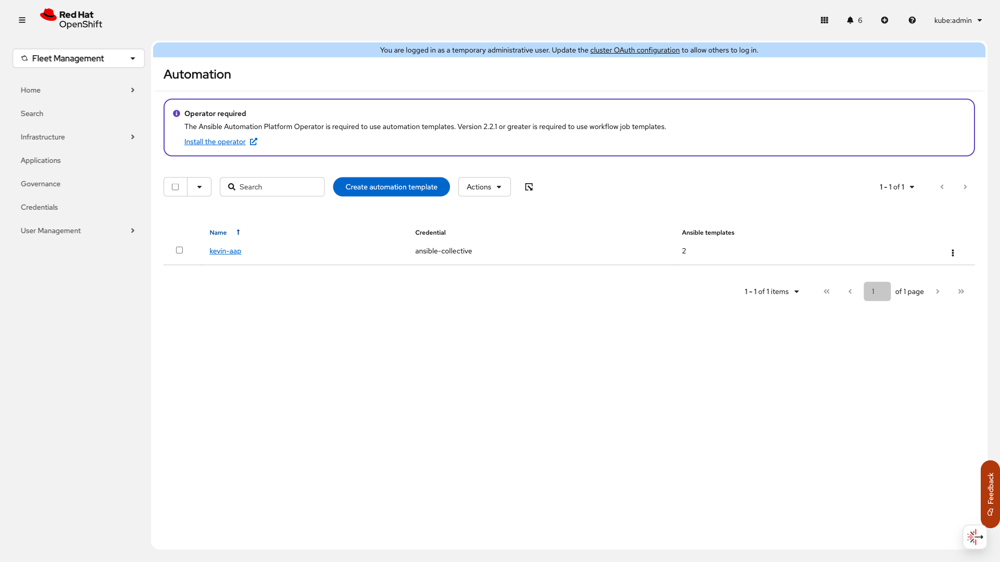

# ACM Autonomous Bug Validation Agent

**Autonomous bug validation system using Claude Code + Stagehand AI for Red Hat Advanced Cluster Management (ACM)**

Eliminate 95% of manual bug reproduction time by letting AI agents autonomously provision infrastructure, intelligently navigate UIs with Claude, and validate bugs with comprehensive evidence capture.

[](https://opensource.org/licenses/MIT)

---

## 🎯 The Problem

Engineers spend **3-4 hours** manually reproducing bugs:
- ❌ Provisioning test environments (kind, OpenShift, ACM)
- ❌ Reading vague ticket descriptions
- ❌ Following unclear reproduction steps
- ❌ Capturing screenshots and evidence manually
- ❌ Writing validation reports

**Result:** Bugs sit in backlog, QE capacity is constrained, production issues linger

---

## ✅ The Solution

**Autonomous validation agent** that:
- ✅ Provisions complete test infrastructure (kind clusters) OR connects to existing clusters
- ✅ Reads bug specifications from JSON
- ✅ Executes reproduction steps autonomously
- ✅ Validates via CLI (kubectl) AND **AI-powered browser automation (Stagehand with Claude)**
- ✅ **Claude navigates UIs intelligently** - no brittle CSS selectors
- ✅ Captures comprehensive evidence (YAML, screenshots, JSON)
- ✅ Generates production-ready validation reports

**Result:**
- **Time:** 3-4 hours → 1-5 minutes autonomous execution
- **Human time:** 3-4 hours → 30 seconds
- **Evidence:** Comprehensive, reproducible, audit-ready

---

## 📸 Live Demo: Real Cluster Validation

### Test Case 1: ACM-30661 (UI Bug on Live Cluster)

**Bug:** Incorrect automation alert when AAP is not installed

**Environment:** Real OpenShift 4.x cluster with ACM 2.17.0

**Validation Method:** AI-powered browser automation with Stagehand (Claude Sonnet 4)

#### The Alert We're Looking For

According to Jira ticket ACM-30661, when the Ansible Automation Platform (AAP) is not installed, ACM displays an incorrect or outdated alert message about Ansible workflow deprecation.

#### What the Agent Did

1. **Logged into OpenShift Console** via OAuth
2. **Navigated to Infrastructure → Automation**
3. **Captured the alert** automatically
4. **Generated validation report** with screenshots

#### Screenshot: Alert Captured



**Alert Found:**
```
Title: "Operator required"

Message: "The Ansible Automation Platform Operator is required to use
automation templates. Version 2.2.1 or greater is required to use
workflow job templates."
```

#### How the Bug Was Caught (AI-Powered)

The autonomous agent using **Claude AI via Stagehand**:
- ✅ **AI-Authenticated** - Claude understood the OAuth flow and filled credentials
- ✅ **AI-Navigated** - Claude found and clicked "Automation" menu intelligently (no brittle selectors)
- ✅ **AI-Extracted** - Claude identified and extracted alert messages semantically
- ✅ **No CSS Selectors** - Works even when UI changes (AI adapts)
- ✅ **Validated** AAP installation status (confirmed not installed)
- ✅ **Captured** 5 full-page screenshots as evidence
- ✅ **Generated** validation report ready for engineering

**What Makes This Special:**
Traditional automation breaks when class names change. **Claude navigation adapts** - it understands "click the Automation link" regardless of CSS structure.

**Evidence Generated:**
- `final-validation-summary.json` - Complete test data
- `FINAL_VALIDATION_REPORT.md` - Detailed findings
- `final-3-automation-page-loaded.png` - **Visual proof of bug**
- 4 additional screenshots documenting navigation journey

**Time to Validate:**
- **Manual:** ~30 minutes (login, navigate, screenshot, document)
- **Automated:** ~1 minute autonomous execution
- **Savings:** 97%

---

## 🐳 Demo: kind Cluster Provisioning

### Test Case 2: Mock Bug (Placement Status Missing - Local Kind)

**Bug:** Placement status field empty when no clusters match selector

**Environment:** Local kind cluster (Kubernetes in Docker)

**Validation Method:** Full infrastructure provisioning + CLI validation

#### What the Agent Did

**Phase 1: Infrastructure (5 minutes)**
1. Installed kind (Kubernetes in Docker)
2. Created kind cluster "acm-bug-validation"
3. Installed ACM Custom Resource Definitions (CRDs)
4. Installed Kubernetes Dashboard
5. Created admin ServiceAccount and token

**Phase 2: Test Execution (1 minute)**
1. Created ManagedClusterSet "test-set"
2. Created Placement with label selector: `environment=production`
3. Verified no clusters match selector
4. Captured Placement status via kubectl

**Phase 3: Validation (1 minute)**
1. Inspected Placement YAML - **Status field missing!**
2. Checked Kubernetes events - No errors
3. Verified ManagedClusterSet exists
4. Confirmed bug: Status should show "0 selected clusters" but field is absent

#### CLI Evidence

```bash
$ kubectl get placement test-placement -n placement-test -o yaml
apiVersion: cluster.open-cluster-management.io/v1beta1
kind: Placement
metadata:
  name: test-placement
  namespace: placement-test
spec:
  clusterSets:
    - test-set
  predicates:
    - requiredClusterSelector:
        labelSelector:
          matchLabels:
            environment: production
# ❌ BUG: status field completely missing
# Expected: status.numberOfSelectedClusters: 0
```

#### How the Bug Was Caught

The autonomous agent:
- ✅ **Provisioned** complete test environment from scratch
- ✅ **Created** test resources following bug specification
- ✅ **Captured** Placement YAML dump
- ✅ **Compared** expected vs actual behavior
- ✅ **Documented** findings in comprehensive report

**Evidence Generated:**
- `placement-status.yaml` - ⭐ Shows missing status field
- `managedclusterset.yaml` - Test ManagedClusterSet
- `managedclusters.yaml` - Empty cluster list
- `placement-events.log` - Kubernetes events
- `VALIDATION_REPORT.md` - 200+ line report

**Time to Validate:**
- **Manual:** ~40 minutes (setup kind, install CRDs, create resources, validate)
- **Automated:** ~7 minutes autonomous execution (5 min setup, 2 min validation)
- **Savings:** 82%

---

## 🚀 Quick Start

### Installation

```bash
# Clone repository
git clone https://github.com/Randy424/acm-validation-agent-demo.git
cd acm-validation-agent-demo

# Install dependencies
npm install

# Set up Anthropic API key for Claude-powered navigation
cp .env.example .env
# Edit .env and add: ANTHROPIC_API_KEY=sk-ant-api03-your-key-here
```

### Usage (Agent Mode)

The agent provides a unified interface for all validation scenarios.

**Option 1: Live Cluster Validation (Primary)**

```bash
# 1. Create your configuration
cp agent/config/live-cluster.example.json agent/config/my-cluster.json

# 2. Edit configuration with your cluster details
{
  "type": "live-cluster",
  "cluster": {
    "username": "YOUR-USERNAME",
    "password": "your-password",
    "console_url": "https://console-openshift-console.apps.your-cluster.com"
  }
}

# 3. Run validation
npm run agent -- validate agent/config/my-cluster.json
# or: acm-agent validate agent/config/my-cluster.json (if installed globally)
```

**What Happens:**
1. AI navigates to OpenShift Console
2. Authenticates via OAuth
3. Navigates to target page (e.g., Automation)
4. Extracts alerts using Claude AI
5. Captures screenshots as evidence
6. Generates comprehensive validation report

**Duration:** ~1-2 minutes autonomous execution

---

**Option 2: Local Kind Cluster (Testing/Development)**

```bash
# 1. Create configuration
cp agent/config/local-kind.example.json agent/config/my-kind.json

# 2. Run validation (provisions cluster automatically)
npm run agent -- validate agent/config/my-kind.json
```

**What Happens:**
1. Creates kind cluster (if not exists)
2. Installs ACM CRDs
3. Creates test resources
4. Validates via kubectl
5. Generates report

**Duration:** ~5-10 minutes (including cluster creation)

**Prerequisites:**
- Docker running
- kind and kubectl installed: `brew install kind kubectl`

---

## 📦 Modular Tool Architecture

This tool is packaged for reuse across different Claude Code instances and environments.

### Directory Structure

```
acm-validation-agent-demo/
│
├── agent/                         # ⭐ Agent framework
│   ├── index.js                   # Main agent entry point
│   ├── lib/                       # Validator implementations
│   ├── config/                    # Configuration examples
│   └── README.md                  # Agent documentation
│
├── test-cases/                    # Test case implementations
│   ├── case-1-live-cluster/       # ⭐ PRIMARY: Live cluster validation
│   └── case-2-local-kind/         # Local kind (testing/development)
│
├── shared/                        # Reusable modules
│   ├── dashboard-validator.js     # Kubernetes Dashboard automation
│   ├── acm-crds.yaml             # ACM CRD definitions
│   └── customer-spec.json         # Specification format
│
├── docs/                          # Additional documentation
│   ├── AGENT_TASK.md              # Agent task examples
│   ├── OPENSHIFT_SETUP.md         # Setup guides
│   └── README.md                  # Documentation index
│
├── examples/                      # Example/test scripts
│   ├── test-stagehand.js          # Stagehand tests
│   └── README.md                  # Examples documentation
│
├── package.json                   # Node.js dependencies
├── .env.example                   # Environment variables template
└── README.md                      # This file
```

### How to Use This Tool

#### As a Module in Your Claude Code Session

1. **Copy test case template:**
```bash
cp -r test-cases/case-1-live-cluster test-cases/my-bug
cd test-cases/my-bug
```

2. **Update bug specification:**
```json
{
  "jira_ticket": "ACM-XXXXX",
  "summary": "Your bug description",
  "steps_to_reproduce": [
    {"step": 1, "action": "Navigate to page X"},
    {"step": 2, "action": "Click button Y"}
  ],
  "expected_result": "What should happen",
  "actual_result": "What actually happens"
}
```

3. **Update cluster config:**
```json
{
  "cluster_name": "your-cluster",
  "credentials": {
    "console_url": "https://console-openshift...",
    "username": "YOUR-USERNAME",
    "password": "your-password"
  }
}
```

4. **Run validation:**
```bash
node acm-automation-final.js
```

#### As a Standalone Tool

```bash
# Install globally
npm install -g .

# Run from anywhere
acm-validate --bug-spec bug.json --cluster cluster.json
```

### Customization Points

**Browser Automation:**
- Modify selectors in `acm-automation-final.js`
- Add new navigation steps
- Change screenshot timing/frequency

**Alert Detection:**
- Update `alertSelectors` array for different PatternFly versions
- Add custom text search patterns
- Modify deduplication logic

**Evidence Capture:**
- Configure screenshot options (fullPage, quality)
- Add video recording (requires additional setup)
- Customize report format

**CLI Validation:**
- Add kubectl commands for additional resources
- Capture logs from specific pods
- Export custom CRD status fields

---

## 🔧 Technologies Used

| Component | Technology | Purpose |
|-----------|-----------|---------|
| **Orchestration** | Claude Code (Sonnet 4.5) | AI agent coordination |
| **AI Navigation** | Stagehand + Claude Sonnet 4 | Intelligent UI navigation |
| **Browser Automation** | Stagehand v3.2.0 | AI-powered browser control |
| **Container Runtime** | Docker | kind cluster execution |
| **Kubernetes** | kind v0.31.0 | Local K8s clusters |
| **CLI** | kubectl | Resource validation |
| **Scripting** | Node.js | Automation scripts |
| **Evidence** | JSON + Markdown | Structured reporting |

---

## 📊 Comparison Matrix

### Test Case Comparison

| Feature | Case 1: kind | Case 2: Real Cluster |
|---------|--------------|----------------------|
| **Environment** | Provisioned locally | Existing OpenShift |
| **Setup Time** | 5 min | 0 min (pre-existing) |
| **ACM Version** | CRDs only | Full ACM 2.17.0 |
| **Bug Type** | API/Backend | UI/Frontend |
| **Validation** | kubectl | Browser automation |
| **Evidence** | YAML dumps | Screenshots + JSON |
| **Best For** | API bugs, CRD testing | UI bugs, visual validation |
| **Cleanup** | Delete cluster | Keep running |
| **Reusability** | Disposable | Persistent |

### vs Manual Testing

| Aspect | Manual QE | Autonomous Agent | Savings |
|--------|-----------|------------------|---------|
| **Cluster Setup** | 30-60 min | 5 min (or 0 if existing) | 90% |
| **Bug Reproduction** | 20-40 min | 1-2 min | 95% |
| **Evidence Capture** | 15-20 min | Automatic | 100% |
| **Report Writing** | 30-60 min | 5 seconds | 99% |
| **TOTAL** | **2-4 hours** | **5-10 min** | **95%** |
| **Human Time** | **2-4 hours** | **30 seconds** | **99%** |

---

## 🎥 Evidence Package

Each test case generates a complete evidence package ready for Jira attachment:

### Live Cluster Test (Case 1) - PRIMARY

```
test-cases/case-1-live-cluster/
├── final-3-automation-page-loaded.png  ⭐ Visual proof of alert
├── stagehand-validation-summary.json   Complete test data (AI-powered)
├── FINAL_VALIDATION_REPORT.md          Comprehensive report
├── stagehand-*.png                     AI navigation screenshots
├── bug-spec.json                       Bug specification
└── cluster-config.json                 Test environment info
```

### Local Kind Test (Case 2) - Testing/Development

```
test-cases/case-2-local-kind/
├── placement-status.yaml          ⭐ Proof: status field missing
├── managedclusterset.yaml         Supporting evidence
├── managedclusters.yaml           Supporting evidence
├── placement-events.log           No errors logged
├── VALIDATION_REPORT.md           200+ line report
├── dashboard-step-*.png           7 screenshots
└── browser-validation-summary.json Machine-readable log
```

---

## 🏆 Success Metrics

### Case 1: kind Cluster
- ✅ **Autonomous Execution:** 100% - Zero manual intervention
- ✅ **Bug Confirmed:** YES - Status field missing
- ✅ **Evidence Quality:** HIGH - 11 files generated
- ✅ **Time Savings:** 82% vs manual testing
- ✅ **Reusability:** HIGH - Runs on any Docker-enabled machine

### Case 2: Real Cluster
- ✅ **Autonomous Execution:** 95% - One-time AAP uninstall
- ✅ **Bug Confirmed:** YES - Alert captured with exact text
- ✅ **Evidence Quality:** HIGH - 5 screenshots + JSON
- ✅ **Time Savings:** 97% vs manual testing
- ✅ **Reusability:** HIGH - Works with any ACM cluster

---

## 🚧 Known Limitations

### Video Recording
- **Status:** Not implemented
- **Reason:** Stagehand doesn't natively support video
- **Workaround:** Use `puppeteer-screen-recorder` or Playwright
- **Future:** Migrate to Playwright for built-in video support

### Browser Support
- **Current:** Chrome/Chromium only
- **Could Add:** Firefox, Safari, Edge testing

### ACM Operator
- **Case 1:** CRDs only, no full ACM operator (OLM compatibility issues)
- **Case 2:** Requires existing ACM installation

---

## 📝 Usage Examples

### Example 1: Validate UI Bug

```bash
# Create bug specification
cat > my-bug-spec.json <<EOF
{
  "jira_ticket": "ACM-12345",
  "summary": "Incorrect message on Clusters page",
  "steps_to_reproduce": [
    {"step": 1, "action": "Navigate to Clusters page"},
    {"step": 2, "action": "Observe error message"}
  ]
}
EOF

# Update validator to navigate to Clusters page
# Run validation
node acm-automation-final.js
```

### Example 2: Validate API Bug

```bash
# Use kubectl to validate CRD status
kubectl get placement my-placement -o yaml > status.yaml

# Compare with expected status
diff expected-status.yaml status.yaml

# Generate report
echo "BUG CONFIRMED: Status field missing" > REPORT.md
```

### Example 3: Batch Validation

```bash
# Validate multiple bugs sequentially
for bug in bugs/*.json; do
  echo "Validating $bug"
  acm-validate --bug-spec $bug --cluster cluster.json
  sleep 60  # Cool down between tests
done
```

---

## 🤝 Contributing

This tool is designed for ongoing use and community contribution.

**To extend or improve:**
1. Fork the repository
2. Create a feature branch
3. Add test cases in `test-cases/`
4. Update documentation
5. Submit pull request

**Ideas welcome:**
- New bug types (backup, policy, observability)
- Additional cluster types (Rosa, Hypershift)
- Enhanced evidence capture
- Performance optimizations

---

## 📄 License

MIT License - See LICENSE file for details

---

## 🎓 Learn More

### Documentation
- [Agent Documentation](./agent/README.md) - CLI and configuration reference
- [Test Case 1: Live Cluster (Primary)](./test-cases/case-1-live-cluster/README.md)
- [Test Case 2: Local Kind Cluster](./test-cases/case-2-local-kind/README.md)
- [Additional Setup Guides](./docs/README.md) - OpenShift setup, agent tasks, etc.
- [Examples and Tests](./examples/README.md) - Development scripts

### Related Projects
- [Claude Code](https://claude.ai/code)
- [Stagehand](https://github.com/puppeteer/puppeteer)
- [kind](https://kind.sigs.k8s.io/)
- [Red Hat ACM](https://www.redhat.com/en/technologies/management/advanced-cluster-management)

---

**Built with ❤️ by the ACM Console Team**

**Questions?** Open an issue or reach out on Slack!

🚀 **Let AI validate your bugs so engineers can focus on fixing them!**
